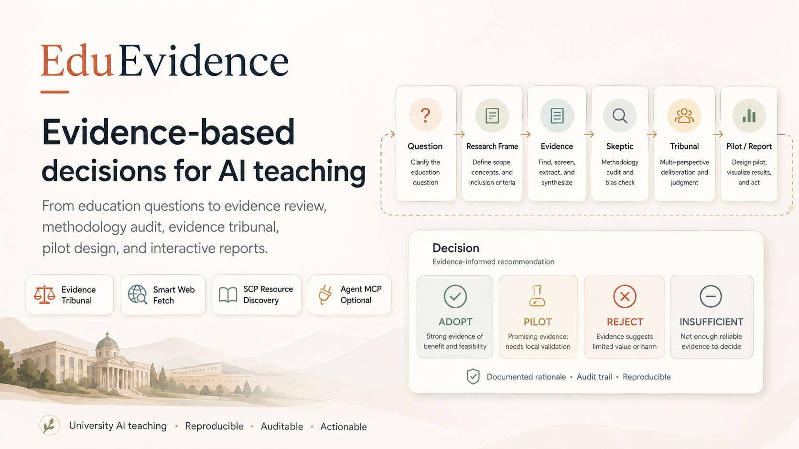
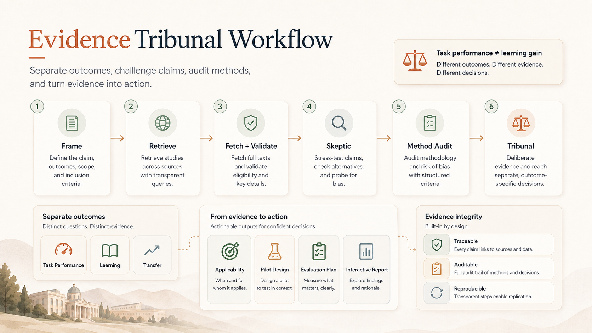
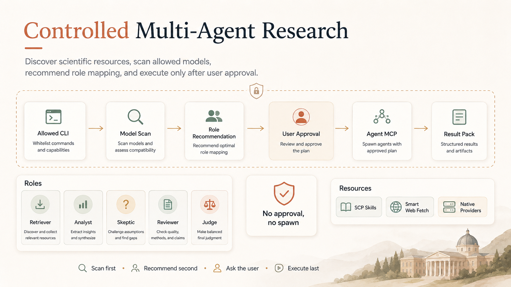

# EduEvidence

> **🌐 [English](README.en.md) | 中文**

## Evidence-Based AI Teaching Decision & Intervention Skill

> **From Education Questions to Evidence-Based Decisions.**
> **从教学问题，到有证据支撑的教学决策。**

EduEvidence 面向高校教师、教学研究者与教学管理者，把"是否采用一种 AI 教学方式"从经验判断转化为**可追溯、可质疑、可验证的证据决策流程**。

- ⚖️ 不是替教师生成答案，而是帮助教师知道：证据支持什么、不能支持什么、适用于谁、应该怎样试点并验证。
- 🧪 基于真实研究（示例包含 CHI 2023 / PNAS 2025 / ACL 2025 / Springer 2024 的实证证据），不做无来源断言。
- 🚦 最终输出不是"允许/禁止"的二元结论，而是 **ADOPT / PILOT / REJECT / INSUFFICIENT EVIDENCE** 四态决策 + 可落地的教学干预与评价方案。



---

## 快速安装

```bash
git clone https://github.com/37chengshan/eduevidence.git
cd eduevidence
bash install.sh              # 一键：venv + 依赖 + 自检 + 测试
```

安装后直接打开示例报告：

```bash
open examples/ai-coding-assistant/EduEvidence_Report.html
```

> 需要 Python 3.10+；核心零第三方依赖。学术图 PNG/PDF 导出可选装 matplotlib。
> 安装完成后脚本会提示为项目点 star（GitHub CLI 已登录则自动执行 `gh repo star 37chengshan/eduevidence`，否则提示打开浏览器）。

---

## 安装为 Skill（AI Agent 用户）

> EduEvidence 本体是一个 **AI Agent Skill**（SKILL.md + skill/agents/ + references/ + schemas/ + scripts/）。
> 安装后，你的宿主 Agent（Claude Code / OMP / Codex / OpenCode / Kimi / ZCode / OpenClaw / Harness / Grok / Copilot / Cline …）就能在收到教学决策类问题时自动装载本 Skill。

```bash
bash install.sh --skill              # 交互式选择安装到哪个 Agent
bash install.sh --list-hosts         # 查看支持的 Agent 与 Skill 落点
bash install.sh --skill --dry-run    # 只预览将执行的变更，不写入
```

安装前脚本会自动备份目标目录中已有的 skill（`cp -r` 到 `.bak-<时间戳>`）；`--dry-run` 只预览不写入。

### 支持的 Agent 与配置落点

| Agent | 探测路径 | Skill 安装落点 |
|---|---|---|
| Claude Code | `~/.claude` | `~/.claude/skills/eduevidence/`（无用户级配置则装到项目 `.claude/skills/`）|
| Codex | `~/.codex` 或 `codex` 命令 | `~/.agents/skills/`（兼容 `~/.codex/skills/`、`~/.codex/prompts/`）|
| OMP | `~/.omp` | `~/.omp/agent/skills/eduevidence/` |
| OpenCode | `~/.config/opencode` | `~/.config/opencode/skills/eduevidence/` |
| Kimi Code | `$KIMI_CODE_HOME` 或 `~/.kimi-code` | `~/.kimi-code/skills/eduevidence/` |
| ZCode | `~/.zcode` | `~/.zcode/skills/eduevidence/` |
| OpenClaw | `~/.openclaw` | `~/.openclaw/skills/eduevidence/` |
| Harness | `~/.harness` | `~/.harness/skills/eduevidence/` |
| Grok | `~/.grok` | `~/.grok/skills/eduevidence/` |
| GitHub Copilot CLI | `~/.copilot` | `~/.copilot/skills/eduevidence/` |
| Cline | `~/.cline` 或 `~/.config/cline` | `~/.cline/skills/eduevidence/` |

交互菜单中：选择 `all` 安装到全部 Agent；`custom` 手动指定 skill 目录；`local` 只装本地（venv + pytest + 自检）。

### 方式三：通用提示词（未列出的 Agent）

你的 Agent 不在列表里？把下面这段提示词**原样**交给任意支持 skill / 自定义指令的 AI，即可手动安装：

```text
请把 https://github.com/37chengshan/eduevidence 仓库中的 EduEvidence 安装为 skill：
1. 将仓库根目录的 SKILL.md、skill/、references/、schemas/、scripts/ 复制到你的 skill 目录
   （如 ~/.claude/skills/eduevidence/、~/.omp/agent/skills/eduevidence/、~/.agents/skills/eduevidence/ 等），
   或按你的 skill 装载机制导入；
2. 安装完成后确认能读取 SKILL.md，并能运行 scripts/ 下的确定性脚本；
3. 告诉我安装结果，并提醒我为项目点 star。
```

脚本在 `--skill` 安装完成后也会打印这段通用提示词。

## What Problem We Solve

普通 AI 面对教育问题通常执行：

```text
问题 → 搜索若干材料 → 总结观点 → 给出建议
```

EduEvidence 执行：

```text
教学问题
  → Education Research Framing（学习者/干预/对照/Outcome/场景）
  → 文献与证据检索（支持证据 + 独立反方证据）
  → Claim-Level Evidence Extraction
  → Skeptic 反证协议 + Method Reviewer 方法学审查
  → Evidence Tribunal（证据裁决）
  → Applicability Analysis（适用性）
  → Decision: ADOPT / PILOT / REJECT / INSUFFICIENT EVIDENCE
  → Teaching Intervention（最小可验证试点）
  → Evaluation Plan（效果评价）
```

最终回答六个问题：

1. 当前证据到底支持什么？
2. 当前证据不能支持什么？
3. 为什么不同研究会得到不同结果？
4. 对哪类学生、什么课程、什么条件适用？
5. 如果学校真的要用，怎样低风险落地？
6. 实施后如何验证它到底有没有效果？

## 30-second Demo

> 主 Demo：**大一 C 语言课程是否应该允许学生使用生成式 AI 编程助手？**

| 时间 | 阶段 |
|---|---|
| 0–20s | 输入教学问题 |
| 20–45s | Education Research Frame |
| 45–75s | Evidence Retrieval |
| 75–110s | Evidence Matrix |
| 110–135s | Methodology + Skeptic |
| 135–155s | Evidence Tribunal |
| 155–170s | Teaching Intervention + Evaluation |
| 170–180s | Benchmark |

完整示例包见 [`examples/ai-coding-assistant/`](examples/ai-coding-assistant/)。

## Why Education Evidence Is Hard

教育研究证据有几个天然陷阱，EduEvidence 的核心创新就是把应对这些陷阱的环节标准化：

- **Outcome Separation**：`代码完成更快 ≠ 真正学会编程`；`短期成绩提高 ≠ 长期保持提高`；`AI 协助完成任务 ≠ 无 AI 环境下能够迁移`。
- **Counter-Evidence Search**：不能只验证用户的最初假设，必须独立寻找 null / negative / contradictory 证据、AI dependency、novelty effect、self-selection bias 等。
- **Evidence Tribunal**：不是简单把正反论文列在一起，而是判断哪些研究更可信、冲突来自样本/测量/课程/工具还是实验设计、目前最多能得出什么结论。
- **Evidence-to-Action Bridge**：不能停在"研究显示……"，必须连到适用性判断、教学决策、试点干预与评价设计。

## How EduEvidence Works

```text
┌─────────────────────────────────────┐
│            EduEvidence              │
│  教育领域知识 + 决策 + 干预 + 评价   │
└────────────────┬────────────────────┘
                 │
┌────────────────▼────────────────────┐
│        EvidenceFlow Protocol        │
│ Frame / Retrieve / Extract /        │
│ Challenge / Audit / Adjudicate      │
└────────────────┬────────────────────┘
                 │
        ┌────────┴────────┐
        ▼                 ▼
 Platform Native      Agent MCP
 Execution Mode      Enhanced Mode
```

完整工作流（9 步）：

```text
1. Frame          构建 EducationResearchFrame
2. Retrieve       文献与证据检索（支持证据 + 独立反方证据）
3. Extract        抽取 Claim-Level Evidence（绑定 Outcome）
4. Challenge      Skeptic 反证协议（固定 9 项检查）
5. Audit          Method Reviewer 方法学审查（15 项清单）
6. Adjudicate     Evidence Tribunal 证据裁决（Evidence Matrix + Verdict）
7. Applicability  适用性分析
8. Intervene      Teaching Intervention 设计（最小可验证试点）
9. Evaluate       Evaluation Plan 设计
```

每一步产出经过 JSON Schema 校验（`schemas/`），确定性逻辑由 `scripts/` 提供，教育方法论在 `references/` 中独立成文。

## Outcome Separation

EduEvidence 强制区分 20 类 Outcome（`references/outcome-taxonomy.md`）：

```text
学习效果:   Knowledge Gain / Concept Understanding / Retention / Transfer / Independent Problem Solving
任务表现:   Completion Time / Accuracy / Code Quality / Assignment Score
学习过程:   Engagement / Motivation / Cognitive Load / Help-Seeking / Metacognition
风险指标:   AI Dependency / Over-reliance / Reduced Effort / Reduced Transfer / Academic Integrity Risk / False Confidence
```

主 Demo 的高光点正是这种区分：Kazemitabaar et al. (CHI 2023) 中 AI 代码助手使任务完成率提升 1.15×、得分提升 1.8×，但一周后的保持测试差异不显著——**任务表现 ≠ 学习效果**。

## Evidence Tribunal

`references/tribunal-policy.md` 定义了裁决规则：输入 Frame + Evidence Matrix + Skeptic Findings + Method Reviews，输出 EducationVerdict（`schemas/verdict.schema.json`），包括：

- supported / uncertain / contradicted claims
- 冲突来源分析（样本 / 测量 / 课程 / 工具 / 实验设计）
- Can Claim / Cannot Claim 边界
- 四态决策 + Confidence（规则化计算，不由模型自由生成）



## From Evidence to Action

证据必须连接到真实教学现场（`references/applicability-policy.md`、`intervention-design.md`、`evaluation-design.md`）：

- **Applicability**：For whom? For which course? For which outcome? Under what conditions? With what AI usage policy?
- **Intervention**：永远是"最小可验证试点"，禁止直接全面部署；含 AI 使用规则、教师/学生角色、反思要求、停止条件。
- **Evaluation**：任何 PILOT/ADOPT 建议必须附评价方案；区分基线/后测/保持测试/迁移测试；区分任务表现指标与学习指标。

## Benchmark

第一版 30 个教育研究问题（`benchmarks/questions.jsonl`），S×10 / M×10 / L×10；其中 15 题为主域"高校 AI 辅助教学"，10 题含人工金标注（`benchmarks/annotations/`）。

基线设计：

```text
B0 Direct LLM
B1 Search + LLM
B2 Standard Research Agent
B3 EduEvidence Single-Agent     ← 证明教育方法论价值（B2 vs B3）
B4 EduEvidence + Agent MCP      ← 证明多 Agent 增强价值（B3 vs B4）
```

核心指标：Citation Support Precision / Unsupported Claim Rate / Contradiction Discovery Rate / Outcome Separation Accuracy / Scope Calibration / Intervention Evidence Alignment。详见 `docs/benchmark.md`。

> ⚠️ 当前 `benchmarks/results/` 为 **harness validation（deterministic simulation）**，仅证明评测框架可运行，不是真实模型性能。真实 B2 vs B3 实证运行结果上线前不会用于效果宣称。

## Example: AI Coding Assistant

> **大学一年级 C 语言课程是否应该允许学生使用生成式 AI 编程助手？**

`examples/ai-coding-assistant/` 完整展示了从问题到决策的全过程：

- **证据**（7 条，均绑定真实来源）：任务表现提升（Kazemitabaar 2023）、无护栏访问损害独立考试表现 -17%（Bastani 2025, PNAS）、护栏设计消除负效应（Bastani 2025）、形成性反馈写作证据（Marzuki 2024）。
- **决策**：**PILOT** —— 任务表现证据强，但大学编程课程的直接学习效应证据缺失，无护栏风险已被证实。
- **干预**：4 阶段试点（Independent Foundation → Explain Don't Solve → Structured Collaboration → Transfer Check）。
- **评价**：无 AI 基线/后测/期末考试保持/无 AI 迁移任务 + AI 依赖风险指标。

另外两个示例：AI 写作助手（`examples/ai-writing-assistant/`）、高数 AI Tutor（`examples/ai-tutor/`）——证明 Skill 不是为一个问题写死。

## Visualization: Bilingual HTML Report + Infographics + Academic Figures

研究完成后，`result.json` 通过确定性适配器渲染为三套可视化产物（全部零第三方依赖，单文件离线可打开）：

```text
result.json + result.zh.json（中文平行数据）
  ├─ build_charts.py        → chart_specs.json（ECharts 规格：结果概览/主张追溯/基准）
  ├─ build_infographics.py  → infographics.json（4 张 AntV 风格 SVG：EvidenceFlow/裁决/干预/评价）
  ├─ build_figures.py       → figures/（出版级学术图：figure_data.json + SVG/PNG/PDF）
  └─ build_report.py        → EduEvidence_Report.html（单文件双语报告 + report_spec.json）
```

**EduEvidence_Report.html（主产物）**：

- **双语切换**：默认中文，顶部一键切换 EN；中文模式下证据、主张、方法学审计、干预与评价全部为中文，数据同构（`result.zh.json` 与 `result.json` 键/数字/ID/URL 一致，由 AI 直接产出双语数据而非机器翻译）。
- **执行摘要叙事**：第一屏"一句话结论"——问题 → 依据（支持/反驳证据）→ 行动（决策+置信度+理由）；每个 Section 顶部有"本节回答：…"导读行。
- **12 个 Section**：执行决策 / 结果证据概览 / 证据矩阵（可筛选搜索）/ 证据裁决 / 方法学审计 / 冲突分析 / 主张-证据追溯 / 适用性 / 教学干预 / 评价方案 / 基准测试 / 来源与溯源。
- **五主题切换**（claude / academic / editorial / datalab / presentation）+ localStorage 持久化。
- **静态优先**：无 JS 也可读（决策/矩阵/裁决/干预/来源）；ECharts 可用时增强交互；表格横向滚动防溢出。
- **完整性门**：图表数字与 result.json 逐项核对，`REPORT_INVALID` 时禁止发布。

> 示例产物直接打开：`examples/ai-coding-assistant/EduEvidence_Report.html`

## Architecture

仓库是一个完整的 **Skill 包**：`SKILL.md` 是入口，其余目录按"Skill 运行必需 → 质量保障 → 演示"分层。详见 [`docs/architecture.md`](docs/architecture.md)：

```text
EduEvidence/  （= 一个 Skill 包）
│
├─ SKILL.md                  ← Skill 入口：When to Use / Inputs / 10 步 Workflow / 输出契约
│
├─ Skill 本体（运行必需）
│  ├─ skill/agents/          8 个角色协议（Planner / Retriever / Analyst / Skeptic /
│  │                         Method Reviewer / Judge / Intervention Designer / Evaluation Designer）
│  ├─ references/            9 个教育方法论文档（证据质量 / 反证协议 / 裁决规则 / 干预设计…）
│  ├─ schemas/               12 个 JSON Schema 数据契约（每步输出的校验门）
│  ├─ scripts/               12 个确定性逻辑脚本（评分 / 矩阵 / 审计 / 渲染）
│  ├─ retrieval/             检索与抓取层（fetch / validate / dedupe / failures）
│  ├─ integrations/          Agent MCP 增强层 + Smart Web Fetch 集成
│  └─ visualization/         结果呈现层（ECharts / 信息图 / 学术图 / 双语 HTML Composer）
│
├─ 质量保障
│  ├─ tests/                 pytest 测试矩阵（50 个用例）
│  └─ benchmarks/            30 题 + 10 题金标注 + B0–B4 评测框架
│
└─ 演示与分发
   ├─ examples/              3 个完整 Research & Decision Pack（含双语 HTML 报告）
   ├─ docs/                  架构 / 方法论 / Benchmark / Demo / 复现指南
   ├─ install.sh             一键安装（本地 / 多 Agent Skill）+ 自检
   ├─ pyproject.toml         打包元数据（核心零第三方依赖）
   └─ README(.en).md         双语说明
```

> Skill 包设计原则：**运行所需的最小集是 `SKILL.md + skill/ + references/ + schemas/ + scripts/`**；`retrieval/`、`integrations/`、`visualization/` 是让 Skill 真正"可运行、可呈现"的执行层；`tests/`、`benchmarks/`、`examples/`、`docs/` 是可信度与上手保障，不影响 Skill 本体。

### SCP / Platform Native Mode

EduEvidence 可完全脱离 Agent MCP 独立运行（无需任何外部服务）：

- 不依赖本地 daemon
- 不依赖某一个 CLI
- 不依赖 Agent MCP
- SKILL.md 可单独理解，核心工作流可完整执行
- 所有 Schema / 方法 / 输出契约独立存在

### Agent MCP Enhanced Mode

Agent MCP 是**性能与可靠性增强层，不是 EduEvidence 成立的前提**（`docs/methodology.md` 的 Complexity Gate）：

- S 级任务：单 Agent 直接执行，0 spawn
- M 级任务：Primary Analysis + Independent Check
- L 级任务：8 角色工作流（Planner / Retriever / Analyst / Skeptic / Method Reviewer / Judge / Intervention Designer / Evaluation Designer）

> 角色数量 ≠ 必须启动的 Agent 数量。Platform Native Mode 由单 Agent 串行执行角色协议。

> 🔒 Agent MCP 原则：**Scan first. Recommend second. Ask the user. Execute only after explicit confirmation.** 未经用户确认不得 spawn；用户拒绝则回退 Native。



## Usage

```bash
# 1. 验证数据符合 Schema 契约
python3 scripts/validate_schema.py --schema schemas/evidence.schema.json \
    --data examples/ai-coding-assistant/evidence.jsonl

# 2. 计算证据质量分与 Confidence
python3 scripts/evidence_score.py examples/ai-coding-assistant/evidence.jsonl

# 3. 生成 Evidence Matrix（主产品界面之一）
python3 scripts/evidence_matrix.py examples/ai-coding-assistant/evidence.jsonl

# 4. 运行 Citation Audit（Claim-证据追溯）
python3 scripts/claim_audit.py --claims claims.jsonl --evidence evidence.jsonl

# 5. 渲染 Research & Decision Pack（Markdown）
python3 scripts/render_report.py \
    --frame examples/ai-coding-assistant/frame.json \
    --evidence examples/ai-coding-assistant/evidence.jsonl \
    --methodology examples/ai-coding-assistant/methodology.json \
    --verdict examples/ai-coding-assistant/verdict.json \
    --intervention examples/ai-coding-assistant/intervention.json \
    --evaluation examples/ai-coding-assistant/evaluation.json \
    --out REPORT.md

# 6. 渲染单文件双语 HTML 报告（主产物）
python3 visualization/eduevidence-report/scripts/build_report.py \
    --result examples/ai-coding-assistant/result.json \
    --out examples/ai-coding-assistant/EduEvidence_Report.html

# 7. 校验 Benchmark 题目集
python3 scripts/benchmark.py --questions benchmarks/questions.jsonl

# 8. 运行测试
pytest
```

> 真实使用中，Skill 由 Agent 读取 SKILL.md 执行 9 步工作流；`scripts/` 保证结构化数据的确定性校验，`visualization/` 保证展示层的确定性渲染，`examples/` 是完整运行示例。

## Methodology

- 教育证据质量框架：五维 0–2 分（D1 研究设计 / D2 样本质量 / D3 测量效度 / D4 时间强度 / D5 直接性），总分 0–10（`references/evidence-quality.md`）。
- 方法学审查 15 项清单，最高优先级规则：**任务完成表现不能自动等价为学习效果**（`references/methodology-audit.md`）。
- Confidence 规则化计算：`Evidence Quality + Consistency + Directness + Evidence Count - Conflict Penalty - Unsupported Penalty` → High / Moderate / Low / Insufficient（`scripts/evidence_score.py`）。
- 失败处理：INSUFFICIENT_SOURCES / UNSUPPORTED_CLAIM / CONFLICT_UNRESOLVED / SCOPE_MISMATCH / METHODOLOGY_TOO_WEAK / NEEDS_USER_CONTEXT / TOOL_FAILURE —— 失败时禁止强行生成高确定性建议。

## Limitations

- 第一版冻结垂直场景：**高校 AI 辅助教学**；翻转课堂、项目式学习等第二阶段扩展。
- Benchmark 基于真实文献的可检索证据；模型实际运行结果需按 `docs/benchmark.md` 的 B0–B4 基线采集。
- 搜索与抽取依赖可用检索资源；`TOOL_FAILURE` 时不编造来源。
- EduEvidence 是教学决策辅助，**不代替教师或学校最终决策**；涉及高风险评价、学生处分、个体心理判断、学生重大教育机会时不自动决策。

## License

MIT — 见 [LICENSE](LICENSE)。
