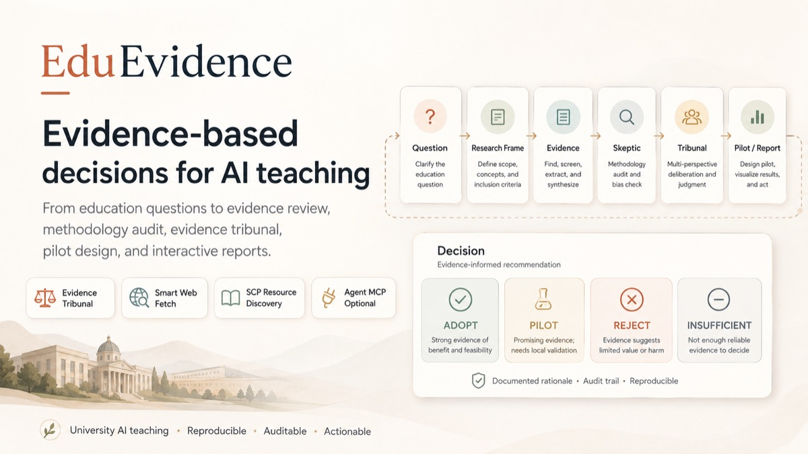
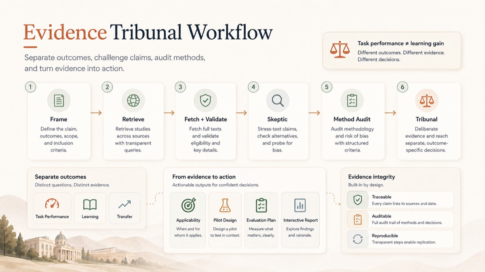
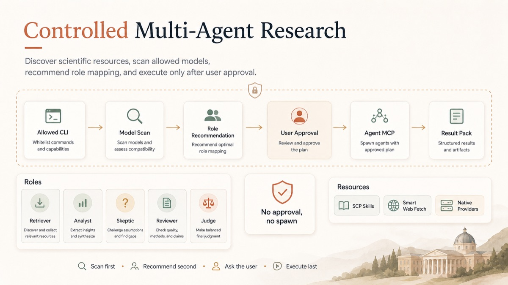

# EduEvidence

> **🌐 English | [中文](README.en.md)**

## EduEvidence Research Engine — Evidence-Based Education Decision Skill

> **From Education Questions to Evidence-Based Decisions.**

EduEvidence is delivered as an **AI Agent Skill**; inside the Skill operates
the **EduEvidence Research Engine** — a persistent, auditable engine that
turns education questions into evidence-grounded decisions.

- **Two Research Modes** — **Evidence Review** (secondary-evidence research)
  and **Full Research Cycle** (Evidence Review → Knowledge Gap → study design
  → your data → analysis → updated decision).
- **Project Workspace + Evidence Graph** — long-lived Projects with versioned,
  immutable graph revisions; `result.json`/HTML/Markdown are projections, not
  fact stores.
- **Shared Research Library** — verified external facts reused via snapshot
  imports; interpretations stay Project-local.
- **Frozen scientific rule** — *No new study design without evidence
  grounding*: designs must reference explicit, evidence-grounded Knowledge
  Gap IDs.
- ⚖️ It does not generate answers for teachers — it shows what the evidence supports, what it cannot support, who it applies to, and how to pilot and verify it.
- 🧪 Built on real research (examples include CHI 2023 / PNAS 2025 / ACL 2025 / Springer 2024 empirical evidence); no claims without sources.
- 🚦 The output is not a binary "allow/forbid" answer but a four-state decision — **ADOPT / PILOT / REJECT / INSUFFICIENT EVIDENCE** — plus an actionable teaching intervention and evaluation plan.
- 🧩 The engine is an internal capability architecture — not a standalone
  server/app; Native Core runs on Python stdlib only and never requires
  Agent MCP or a daemon.



---

## Quick Install

```bash
git clone https://github.com/37chengshan/eduevidence.git
cd eduevidence
bash install.sh              # one-click: venv + deps + self-check + tests
```

Open the example report right away:

```bash
open examples/ai-coding-assistant/EduEvidence_Report.html
```

> Requires Python 3.10+; the core has zero third-party dependencies. `pip install matplotlib` is optional for academic-figure PNG/PDF export.
> After install, the script prompts you to star the repo (prompt only — it never runs any GitHub command on your behalf).

---

## Install as a Skill (for AI Agent users)

> EduEvidence itself is an **AI Agent Skill** (`SKILL.md` + `skill/agents/` + `references/` + `schemas/` + `scripts/` + `retrieval/` + `integrations/` + `visualization/`).
> Once installed, your host agent (Claude Code / OMP / Codex / OpenCode / Kimi / ZCode / OpenClaw / Harness / Grok / Copilot / Cline …) can auto-load this Skill when it receives teaching-decision questions.

```bash
bash install.sh --skill              # interactive: choose which agent to install to
bash install.sh --list-hosts         # list supported agents and skill locations
bash install.sh --skill --dry-run    # preview only, write nothing
```

You can also run it remotely without cloning:

```bash
bash -c "$(curl -fsSL https://raw.githubusercontent.com/37chengshan/eduevidence/main/install.sh)"
```

Before writing, the script automatically backs up any existing skill directory (`cp -r` to `.bak-<timestamp>`); `--dry-run` only previews the changes.

### Supported agents and install locations

| Agent | Detection path | Skill install location |
|---|---|---|
| Claude Code | `~/.claude` | `~/.claude/skills/eduevidence/` (project `.claude/skills/` when no user-level config) |
| Codex | `~/.codex` or `codex` command | `~/.agents/skills/` (falls back to `~/.codex/skills/`, `~/.codex/prompts/`) |
| OMP | `~/.omp` | `~/.omp/agent/skills/eduevidence/` |
| OpenCode | `~/.config/opencode` | `~/.config/opencode/skills/eduevidence/` |
| Kimi Code | `$KIMI_CODE_HOME` or `~/.kimi-code` | `~/.kimi-code/skills/eduevidence/` |
| ZCode | `~/.zcode` | `~/.zcode/skills/eduevidence/` |
| OpenClaw | `~/.openclaw` | `~/.openclaw/skills/eduevidence/` |
| Harness | `~/.harness` | `~/.harness/skills/eduevidence/` |
| Grok | `~/.grok` | `~/.grok/skills/eduevidence/` |
| GitHub Copilot CLI | `~/.copilot` | `~/.copilot/skills/eduevidence/` |
| Cline | `~/.cline` or `~/.config/cline` | `~/.cline/skills/eduevidence/` |

In the interactive menu: pick `all` to install to every agent, `custom` to type a directory manually, or `local` for local-only install (venv + pytest + self-check).

### Method 3: Universal prompt (agents not listed)

Your agent is not in the list? Paste the following prompt **verbatim** into any AI that supports skills / custom instructions:

```text
Follow the install guide at https://github.com/37chengshan/eduevidence/blob/main/docs/install-guide.md
to install EduEvidence as a skill for me: read the doc first, then per Section 2's
landing table copy SKILL.md, skill/, references/, schemas/, scripts/, retrieval/,
integrations/, visualization/ into my skill directory (or import via my loading
mechanism), then complete the Section 3 verification (SKILL.md readable + scripts
runnable + sample report renderable).
```

## What Problem We Solve

A typical AI answers an education question like this:

```text
Question → Search a few sources → Summarize opinions → Give advice
```

EduEvidence does this instead:

```text
Education question
  → Education Research Framing (learner / intervention / comparison / outcomes / context)
  → Literature & evidence retrieval (supporting evidence + independent counter-evidence)
  → Claim-Level Evidence Extraction
  → Skeptic challenge protocol + Method Reviewer audit
  → Evidence Tribunal
  → Applicability Analysis
  → Decision: ADOPT / PILOT / REJECT / INSUFFICIENT EVIDENCE
  → Teaching Intervention (minimum viable pilot)
  → Evaluation Plan
```

It answers six questions:

1. What does the current evidence actually support?
2. What can the current evidence not support?
3. Why do different studies reach different results?
4. Which students, which courses, under which conditions does it apply to?
5. If an institution adopts it, how to roll it out with low risk?
6. How to verify whether it actually works after implementation?

## 30-second Demo

> Main demo: **Should first-year C programming students be allowed to use generative AI coding assistants?**

| Time | Stage |
|---|---|
| 0–20s | Ask the education question |
| 20–45s | Education Research Frame |
| 45–75s | Evidence Retrieval |
| 75–110s | Evidence Matrix |
| 110–135s | Methodology + Skeptic |
| 135–155s | Evidence Tribunal |
| 155–170s | Teaching Intervention + Evaluation |
| 170–180s | Benchmark |

Full example pack: [`examples/ai-coding-assistant/`](examples/ai-coding-assistant/).

## Why Education Evidence Is Hard

Education evidence has natural pitfalls. EduEvidence's core contribution is standardizing the countermeasures:

- **Outcome Separation**: `faster task completion ≠ actually learning to program`; `short-term score gains ≠ long-term retention`; `completing tasks with AI ≠ transferring skills without AI`.
- **Counter-Evidence Search**: it does not just verify the user's initial assumption — it independently searches for null / negative / contradictory evidence, AI dependency, novelty effects, self-selection bias, and more.
- **Evidence Tribunal**: instead of listing pros and cons, it judges which studies are more credible, whether conflicts come from samples / measurement / course / tool / design, and what can be concluded so far.
- **Evidence-to-Action Bridge**: it does not stop at "research shows…" — it connects to applicability, the teaching decision, pilot intervention, and evaluation design.

## How EduEvidence Works

```text
┌─────────────────────────────────────┐
│            EduEvidence              │
│  education knowledge + decision +   │
│  intervention + evaluation          │
└────────────────┬────────────────────┘
                 │
┌────────────────▼────────────────────┐
│        EvidenceFlow Protocol        │
│ Frame / Retrieve / Extract /        │
│ Challenge / Audit / Adjudicate      │
└────────────────┬────────────────────┘
                 │
        ┌────────┴────────┐
        ▼                 ▼
 Platform Native      Agent MCP
 Execution Mode      Enhanced Mode
```

The 9-step workflow:

```text
1. Frame          Build the EducationResearchFrame
2. Retrieve       Retrieve literature & evidence (support + independent counter-evidence)
3. Extract        Extract claim-level evidence (bound to outcomes)
4. Challenge      Skeptic protocol (fixed 9 checks)
5. Audit          Method Reviewer audit (15-item checklist)
6. Adjudicate     Evidence Tribunal (Evidence Matrix + Verdict)
7. Applicability  Applicability analysis
8. Intervene      Teaching Intervention design (minimum viable pilot)
9. Evaluate       Evaluation Plan design
```

Every step is validated against JSON Schemas (`schemas/`), deterministic logic lives in `scripts/`, and the education methodology is documented independently in `references/`.

## Outcome Separation

EduEvidence enforces 20 outcome types (`references/outcome-taxonomy.md`):

```text
Learning:    Knowledge Gain / Concept Understanding / Retention / Transfer / Independent Problem Solving
Task:        Completion Time / Accuracy / Code Quality / Assignment Score
Process:     Engagement / Motivation / Cognitive Load / Help-Seeking / Metacognition
Risk:        AI Dependency / Over-reliance / Reduced Effort / Reduced Transfer / Academic Integrity Risk / False Confidence
```

The demo's highlight: in Kazemitabaar et al. (CHI 2023), the AI code assistant raised task completion by 1.15× and correctness by 1.8×, but the one-week retention test showed no significant difference — **task performance ≠ learning**.

## Evidence Tribunal

`references/tribunal-policy.md` defines the adjudication rules: input = Frame + Evidence Matrix + Skeptic Findings + Method Reviews; output = EducationVerdict (`schemas/verdict.schema.json`), including:

- supported / uncertain / contradicted claims
- conflict-source analysis (sample / measurement / course / tool / design)
- Can Claim / Cannot Claim boundaries
- four-state decision + Confidence (rule-based, not model-generated freely)



## From Evidence to Action

Evidence must connect to the real classroom (`references/applicability-policy.md`, `intervention-design.md`, `evaluation-design.md`):

- **Applicability**: For whom? For which course? For which outcome? Under what conditions? With what AI usage policy?
- **Intervention**: always a "minimum viable pilot", never direct full deployment; includes AI usage rules, teacher/student roles, reflection requirements, and stop conditions.
- **Evaluation**: every PILOT/ADOPT recommendation must come with an evaluation plan; distinguishes baseline / post-test / retention / transfer, and task-performance vs learning metrics.

## Benchmark

30 education research questions in v1 (`benchmarks/questions.jsonl`), S×10 / M×10 / L×10; 15 in the core domain "AI-assisted university teaching", 10 with human gold annotations (`benchmarks/annotations/`).

Baseline design:

```text
B0 Direct LLM
B1 Search + LLM
B2 Standard Research Agent
B3 EduEvidence Single-Agent     ← demonstrates the value of the education methodology (B2 vs B3)
B4 EduEvidence + Agent MCP      ← demonstrates the value of multi-agent enhancement (B3 vs B4)
```

Key metrics: Citation Support Precision / Unsupported Claim Rate / Contradiction Discovery Rate / Outcome Separation Accuracy / Scope Calibration / Intervention Evidence Alignment. See `docs/benchmark.md`.

> ⚠️ `benchmarks/results/` is **harness validation (deterministic simulation, marked SIMULATED)** — it proves the evaluation framework runs, not real model performance. The **first round of Layer B empirical runs has been launched** (B2 vs B3, 10 questions × 3 repeats, `omp` driver with `deepseek-v4-flash` — see `benchmarks/empirical/run-empirical-01`, report at `benchmarks/empirical/v3-report.md`). Metrics are gold-based heuristics (`method: heuristic`); results remain limited by the model and question set, so no definitive effectiveness claim is made until the runs are reviewed.

## Example: AI Coding Assistant

> **Should first-year C programming students be allowed to use generative AI coding assistants?**

`examples/ai-coding-assistant/` shows the full path from question to decision:

- **Evidence** (7 items, all bound to real sources): task-performance gains (Kazemitabaar 2023), unguarded access harming independent exam performance by −17% (Bastani 2025, PNAS), guardrails eliminating the negative effect (Bastani 2025), formative-feedback writing evidence (Marzuki 2024).
- **Decision**: **PILOT** — task-performance evidence is strong, but direct learning-effect evidence for university programming courses is missing, and the unguarded-access risk is documented.
- **Intervention**: 4-phase pilot (Independent Foundation → Explain Don't Solve → Structured Collaboration → Transfer Check).
- **Evaluation**: no-AI baseline / post-test / final-exam retention / no-AI transfer task + AI-dependency risk metrics.

Two more examples — AI writing assistant (`examples/ai-writing-assistant/`) and a calculus AI tutor (`examples/ai-tutor/`) — show the skill is not hard-coded to one question.

## Visualization: Bilingual HTML Report + Infographics + Academic Figures

After research completes, `result.json` is rendered into three visualization outputs by deterministic adapters (all zero third-party dependencies, single-file offline):

```text
result.json + result.zh.json (Chinese parallel data)
  ├─ build_charts.py        → chart_specs.json (ECharts specs: outcome overview / claim trace / benchmark)
  ├─ build_infographics.py  → infographics.json (4 AntV-style SVGs: EvidenceFlow / tribunal / intervention / evaluation)
  ├─ build_figures.py       → figures/ (publication figures: figure_data.json + SVG/PNG/PDF)
  └─ build_report.py        → EduEvidence_Report.html (single-file bilingual report + report_spec.json)
```

**EduEvidence_Report.html (main deliverable)**:

- **Bilingual switch**: Chinese by default, one click to EN; in Chinese mode the evidence, claims, methodology audit, intervention and evaluation are all in Chinese. Data is isomorphic (`result.zh.json` and `result.json` share keys/numbers/IDs/URLs — bilingual data produced directly by AI, not machine translation).
- **Executive summary narrative**: the first screen shows a "bottom line" — question → evidence (support/contradict) → action (decision + confidence + rationale); every section opens with a "What this section answers:" lead line.
- **Two-page layout**: Visual Brief + Full Report (AI-planned 5–7 dynamic chapters, not a fixed template).
- **Five styles (chosen at generation time, no in-HTML switcher)**: claude [Light] / academic [Light] / datalab [Light] / datalab-dark [Dark] / presentation [Dark] — same data, different presentation only.
- **Static-first**: fully readable without JS (decision / matrix / tribunal / intervention / sources); ECharts enhances when available; tables scroll horizontally instead of overflowing.
- **Integrity gate**: chart numbers are checked against result.json item by item; publishing is blocked with `REPORT_INVALID` on mismatch.

> Open the example directly: `examples/ai-coding-assistant/EduEvidence_Report.html`

## Architecture

The repository is a complete **Skill package**: `SKILL.md` is the entry point; everything else is layered as *skill core → quality assurance → demos*. See [`docs/architecture.md`](docs/architecture.md):

```text
EduEvidence/  (= one Skill package)
│
├─ SKILL.md                  ← Skill entry: When to Use / Inputs / Workflow / Output Contract
│
├─ Skill core (required to run)
│  ├─ engine/                V2 Research Engine (Project Workspace / immutable Evidence
│  │                         Graph / Library / synthesis / tribunal / study design /
│  │                         datasets / analysis / projections / migration)
│  ├─ skill/agents/          role protocols (capability execution profiles)
│  ├─ references/            11 education methodology documents (evidence quality / skeptic /
│  │                         tribunal policy / intervention design…)
│  ├─ schemas/               V1 + v2/v3 contracts (13 top-level + 17 v2 + v3 pilot/synthesis/run-manifest)
│  ├─ scripts/               deterministic logic scripts (scoring / matrix / audit /
│  │                         confidence / orchestrator / startup probe / V2 CLI)
│  ├─ retrieval/             Search & fetch layer (fetch / validate / dedupe / failures)
│  ├─ integrations/          Agent MCP enhancement layer + Smart Web Fetch integration
│  └─ visualization/         Presentation layer (ECharts / infographics / academic figures /
│                            bilingual HTML composer + V2 project surfaces)
│
├─ Quality assurance
│  ├─ tests/                 pytest test matrix (V1 + V2, ~430 cases)
│  └─ benchmarks/            V1 questions + benchmarks/v2/ (graph/contract metrics)
│
└─ Demos & distribution
   ├─ examples/              Research & Decision Packs + full-research-cycle-fixture (synthetic)
   ├─ docs/                  architecture / methodology / benchmark / demo / reproducibility
   ├─ install.sh             one-click install (local / multi-agent Skill) + self-check
   ├─ pyproject.toml         packaging metadata (wheel ships CLI + engine; stdlib-only core)
   └─ README(.en).md         bilingual docs
```

> Skill-package principle: the **minimal runtime set is `SKILL.md + engine/ + skill/ + references/ + schemas/ + scripts/`**; `retrieval/`, `integrations/`, `visualization/` are the execution/presentation layers that make the Skill actually runnable; `tests/`, `benchmarks/`, `examples/`, `docs/` provide credibility and onboarding — none of them affect the Skill body itself.

### SCP / Platform Native Mode

EduEvidence runs fully standalone without Agent MCP (no external service required):

- No local daemon
- No dependency on any single CLI
- No Agent MCP dependency
- SKILL.md is self-contained; the core workflow runs end to end
- All schemas / methods / output contracts exist independently

### Agent MCP Enhanced Mode

Agent MCP is a **performance & reliability enhancement layer, not a prerequisite** (Complexity Gate in `docs/methodology.md`):

- S-level tasks: single agent, 0 spawns
- M-level tasks: Primary Analysis + Independent Check
- L-level tasks: 8-role workflow (Planner / Retriever / Analyst / Skeptic / Method Reviewer / Judge / Intervention Designer / Evaluation Designer)

> Number of roles ≠ number of agents that must be launched. Platform Native Mode runs the role protocols sequentially in a single agent.

> 🔒 Agent MCP principle: **Scan first. Recommend second. Ask the user. Execute only after explicit confirmation.** No spawn without user approval; reject → fall back to Native.




## Usage

```bash
# 1. Validate data against the schema contracts
python3 scripts/validate_schema.py --schema schemas/evidence.schema.json \
    --data examples/ai-coding-assistant/evidence.jsonl

# 2. Compute evidence quality scores and Confidence
python3 scripts/evidence_score.py examples/ai-coding-assistant/evidence.jsonl

# 3. Generate the Evidence Matrix (one of the core views)
python3 scripts/evidence_matrix.py examples/ai-coding-assistant/evidence.jsonl

# 4. Run the Citation Audit (claim-evidence traceability)
python3 scripts/claim_audit.py --claims claims.jsonl --evidence evidence.jsonl

# 5. Render the Research & Decision Pack (Markdown)
python3 scripts/render_report.py \
    --frame examples/ai-coding-assistant/frame.json \
    --evidence examples/ai-coding-assistant/evidence.jsonl \
    --methodology examples/ai-coding-assistant/methodology.json \
    --verdict examples/ai-coding-assistant/verdict.json \
    --intervention examples/ai-coding-assistant/intervention.json \
    --evaluation examples/ai-coding-assistant/evaluation.json \
    --out REPORT.md

# 6. Render the single-file bilingual HTML report (main deliverable)
python3 visualization/eduevidence-report/scripts/build_report.py \
    --result examples/ai-coding-assistant/result.json \
    --out examples/ai-coding-assistant/EduEvidence_Report.html

# 7. Validate the benchmark question set
python3 scripts/benchmark.py --questions benchmarks/questions.jsonl

# 8. Run the tests
pytest
```

> In real use, the Skill is executed by an agent that reads SKILL.md and runs the 9-step workflow; `scripts/` guarantees deterministic validation of structured data, `visualization/` guarantees deterministic rendering, and `examples/` are complete runnable packs.

## Methodology

- Education evidence quality framework: five dimensions, 0–2 each (D1 study design / D2 sample quality / D3 measurement validity / D4 temporal strength / D5 directness), total 0–10 (`references/evidence-quality.md`).
- 15-item methodology audit; top-priority rule: **task performance must not be equated with learning** (`references/methodology-audit.md`).
- Rule-based Confidence: `Evidence Quality + Consistency + Directness + Evidence Count − Conflict Penalty − Unsupported Penalty` → High / Moderate / Low / Insufficient (`scripts/evidence_score.py`).
- Failure handling: INSUFFICIENT_SOURCES / UNSUPPORTED_CLAIM / CONFLICT_UNRESOLVED / SCOPE_MISMATCH / METHODOLOGY_TOO_WEAK / NEEDS_USER_CONTEXT / TOOL_FAILURE — on failure, high-confidence recommendations are never forced.

## Limitations

- The benchmark is based on retrievable evidence from real literature; actual model runs must be collected per the B0–B4 baselines in `docs/benchmark.md`.
- Search and extraction depend on available retrieval resources; `TOOL_FAILURE` never fabricates sources.
- EduEvidence assists teaching decisions — **it does not replace the final decision of teachers or institutions**; it never auto-decides on high-stakes assessment, student discipline, individual psychological judgments, or major student educational opportunities.

## Roadmap

**Completed — harness / simulation only (marked as SIMULATED, not empirical):**

- [x] Benchmark v2 harness / simulation — `benchmarks/results/` is a deterministic
  simulation that proves the evaluation framework runs; it is **not** real model
  performance (see the ⚠️ note in [Benchmark](#benchmark)).
- [x] Skill core & pipeline: 9-step protocol (Research Core 6 + Decision Extension 3),
  13 top-level JSON Schemas, deterministic scripts, 8-role protocols (original Phases 0–6).
- [x] Evidence-to-action: applicability / four-state decision / intervention / evaluation.
- [x] Product UI: single-file bilingual HTML report + infographics + academic figures
  (original Phase 8).

**Planned — not yet done, and not claimed as done:**

- [ ] **Empirical Benchmark** — first round **launched** (B2 vs B3, 10 questions × 3
  repeats, `omp` / `deepseek-v4-flash` → `benchmarks/empirical/v3-report.md`);
  full 30-question coverage, **B3 vs B4**, variance reporting, and
  gold-annotation / independent-judge scoring still planned (see `docs/benchmark.md`).
- [ ] **HTML accessibility** — sync `<html lang>` on language switch, `aria-pressed` on
  theme/lang buttons, labeled table filter controls, bilingual `title`/`desc` on SVG
  figures, and a safe URL scheme allowlist for source links.
- [ ] **Vertical decision loop** — close **PILOT → real data → re-adjudication**:
  feed pilot outcomes back into the project evidence graph and produce an updated
  decision (Full Research Cycle end-to-end with real user data).

## License

MIT — see [LICENSE](LICENSE).
