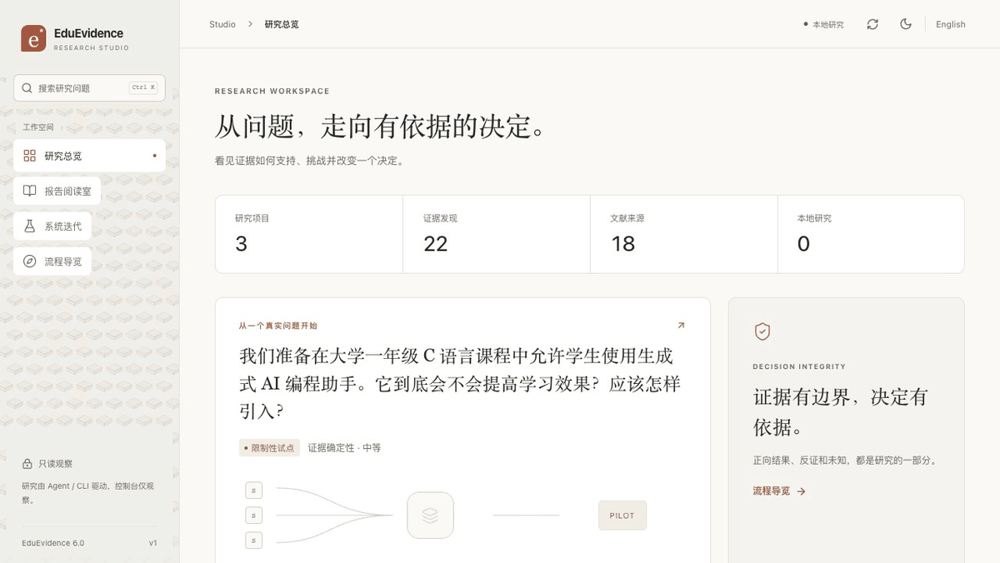
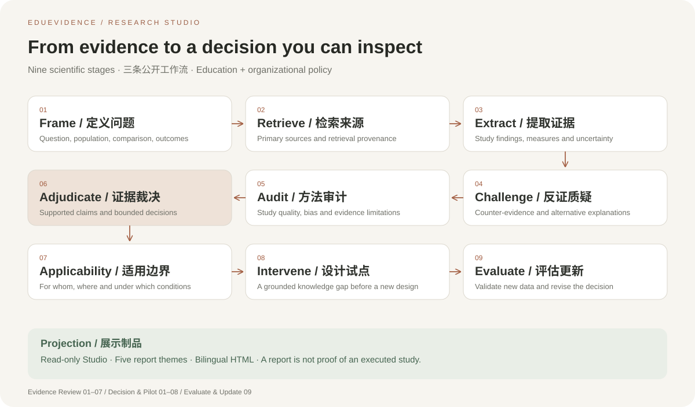
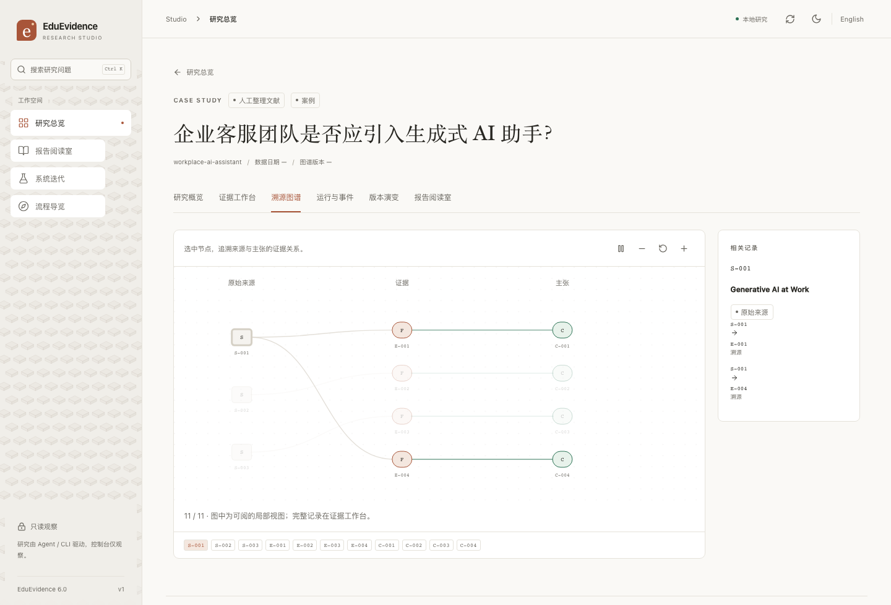
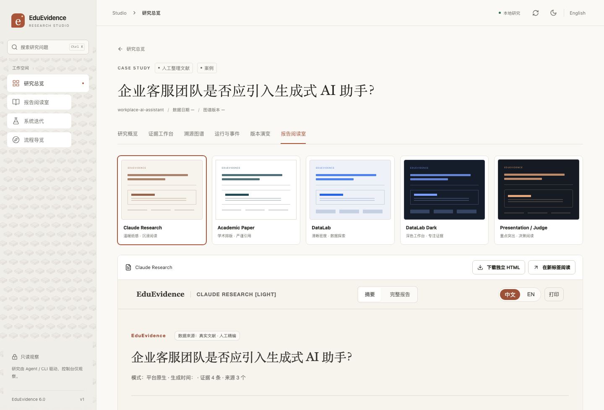
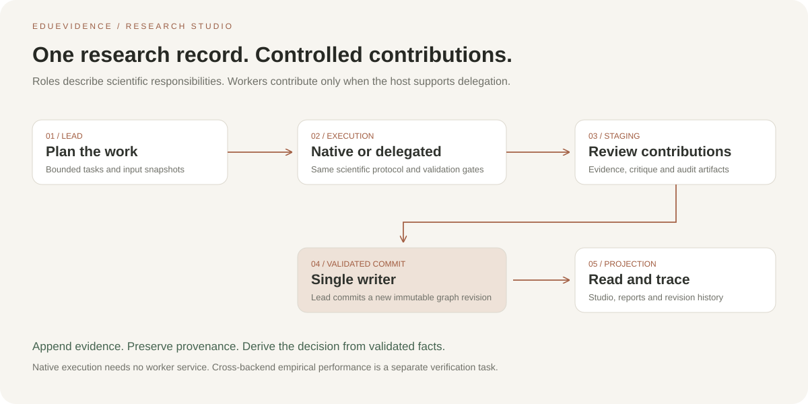

<p align="center">
  
</p>

# EduEvidence

> **🌐 English | [中文](README.zh-CN.md)**

## EduEvidence Research Engine — Evidence Research & Decision Skill

> **From Research Questions to Evidence-Based Decisions.** · Current release **6.2.0**

EduEvidence is delivered as an **AI Agent Skill**; inside the Skill operates
the **EduEvidence Research Engine** — a persistent, auditable engine that
turns a decision question into an evidence-grounded answer. It is **multi-domain**:
the domain registry (`domains/manifest.json`) ships **education** and **policy**
today, each declaring its own frame schema, outcome taxonomy and methodology
checklist, so one nine-stage protocol serves education and applied social science
work without forking the engine.

- **Three public workflows** — **Evidence Review**, **Decision & Pilot**, and
  **Evaluate & Update**. A full research cycle connects existing evidence,
  grounded knowledge gaps, a study design, new data and a revised decision.
- **Multi-domain by contract** — `education` and `policy` are registered domains;
  a run validates against its own domain's frame schema and outcome taxonomy
  (`engine/taxonomy.py` is the single authority; unknown tokens fail closed).
- **Retrieval that stays traceable** — zero-config channels (OpenAlex / Semantic
  Scholar / CrossRef / AIHot / AgentSearch / DuckDuckGo) plus key-based channels:
  **Sciverse** (citation-grade academic retrieval with full-text locators),
  Tavily and Brave. A lookup snippet is a locator, never evidence.
- **Project Workspace + Evidence Graph** — long-lived Projects with versioned,
  immutable graph revisions; `result.json`/HTML/Markdown are projections, not
  fact stores.
- **Shared Research Library** — verified external facts reused via snapshot
  imports; interpretations stay Project-local.
- **Frozen scientific rule** — *No new study design without evidence
  grounding*: designs must reference explicit, evidence-grounded Knowledge
  Gap IDs.
- ⚖️ Inspect what the evidence supports, what it cannot support, who it applies to, and how to pilot and verify it.
- 🧪 Built on real research (examples include CHI 2023 / PNAS 2025 / ACL 2025 / Springer 2024 empirical evidence); no claims without sources.
- 🚦 The output is not a binary "allow/forbid" answer but a four-state decision — **ADOPT / PILOT / REJECT / INSUFFICIENT EVIDENCE** — plus an actionable intervention and evaluation plan.
- 🧩 The engine is an internal capability architecture — not a standalone
  server/app; Native Core runs on Python stdlib only and never requires
  Agent MCP or a daemon.



*Recorded from the actual local Studio — no mockups: overview → report library → five report identities. Below, the introduction page walkthrough:*


---

## Quick Start

**Fastest path — read a finished report (no install):**

```bash
open examples/ai-coding-assistant-evidence/EduEvidence_Report.html
open examples/spaced-retrieval-practice/EduEvidence_Report.html   # real Sciverse run
```

**Look at the console (Python 3.10+, Node not required):**

```bash
python3 scripts/dashboard_server.py --host 127.0.0.1 --port 8765
# browser: http://127.0.0.1:8765/studio/   (read-only research console)
```

**Install it:**

**npm (recommended for Skill install)**

```bash
npm install -g eduevidence
eduevidence skill                  # interactive: pick your agent (claude / cursor / codex / …)
eduevidence skill --list-hosts     # or preview all supported agents first
# non-interactive: eduevidence skill --host cursor
```

**git clone (full dev setup + examples)**

```bash
git clone https://github.com/37chengshan/eduevidence.git
cd eduevidence
bash install.sh              # one-click: venv + deps + self-check + tests
```

Open the example report right away:

```bash
open examples/ai-coding-assistant-evidence/EduEvidence_Report.html
```

> Requires Python 3.10+; the core has zero third-party dependencies. `pip install matplotlib` is optional for academic-figure PNG/PDF export.
> After install, the script prompts you to star the repo (prompt only — it never runs any GitHub command on your behalf).

---

## Install as a Skill (for AI Agent users)

> EduEvidence itself is an **AI Agent Skill** (`SKILL.md` + `skill/agents/` + `references/` + `schemas/` + `scripts/` + `retrieval/` + `integrations/` + `visualization/`).
> Once installed, your host agent (Claude Code / OMP / Codex / OpenCode / Kimi / ZCode / OpenClaw / Harness / Grok / Copilot / Cline …) can auto-load this Skill when it receives teaching-decision questions.

```bash
npm install -g eduevidence
eduevidence skill                  # interactive host picker (default)
eduevidence skill --list-hosts
eduevidence skill --dry-run
eduevidence skill --host cursor    # optional: skip the menu
```

Or from a git clone:

```bash
bash install.sh --skill              # interactive: choose which agent to install to
bash install.sh --list-hosts         # list supported agents and skill locations
bash install.sh --skill --host claude
bash install.sh --skill --dry-run    # preview only, write nothing
```

You can also run it remotely without cloning:

> ⚠️ Supply-chain note (E7): `curl | bash` executes a remote script. Prefer
> cloning and reviewing first, or pin the URL to a specific commit.

```bash
bash -c "$(curl -fsSL https://raw.githubusercontent.com/37chengshan/eduevidence/main/install.sh)"
```

Before writing, the script automatically backs up any existing skill directory (`cp -r` to `.bak-<timestamp>`); `--dry-run` only previews the changes. Side effects: creates a Python venv, writes `~/.eduevidence/env` (`AGENT_MCP_INSTALLED=1`).

### Supported agents and install locations

| Agent | Detection path | Skill install location |
|---|---|---|
| Cursor | `~/.cursor` | `~/.cursor/skills/eduevidence/` |
| Claude Code | `~/.claude` | `~/.claude/skills/eduevidence/` (project `.claude/skills/` when no user-level config) |
| Codex | `~/.codex` or `codex` command | `~/.agents/skills/` (falls back to `~/.codex/skills/`, `~/.codex/prompts/`) |
| OMP | `~/.omp` | `~/.omp/agent/skills/eduevidence/` |
| OpenCode | `~/.config/opencode` | `~/.config/opencode/skills/eduevidence/` |
| Kimi Code | `$KIMI_CODE_HOME` or `~/.kimi-code` | `~/.kimi-code/skills/eduevidence/` |
| ZCode | `~/.zcode` | `~/.zcode/skills/eduevidence/` |
| OpenClaw | `~/.openclaw` | `~/.openclaw/skills/eduevidence/` |
| Harness | `~/.harness` | `~/.harness/skills/eduevidence/` |
| Grok | `~/.grok` | `~/.grok/skills/eduevidence/` |
| GitHub Copilot CLI | `~/.copilot` | `~/.copilot/skills/eduevidence/` |
| Cline | `~/.cline` or `~/.config/cline` | `~/.cline/skills/eduevidence/` |

In the interactive menu: pick `all` to install to every agent, `custom` to type a directory manually, or `local` for local-only install (venv + pytest + self-check).

### Method 3: Universal prompt (agents not listed)

Your agent is not in the list? Paste the following prompt **verbatim** into any AI that supports skills / custom instructions:

```text
Follow the install guide at https://github.com/37chengshan/eduevidence/blob/main/docs/install-guide.md
to install EduEvidence as a skill for me: read the doc first, then per Section 2's
landing table copy SKILL.md, skill/, references/, schemas/, scripts/, retrieval/,
integrations/, visualization/ into my skill directory (or import via my loading
mechanism), then complete the Section 3 verification (SKILL.md readable + scripts
runnable + sample report renderable).
```

## What Problem We Solve

A typical AI answers a decision question like this:

```text
Question → Search a few sources → Summarize opinions → Give advice
```

EduEvidence does this instead:

```text
Decision question (education or applied social science)
  → Domain Research Framing (learner or decision object / intervention / comparison / outcomes / context)
  → Literature & evidence retrieval (supporting evidence + independent counter-evidence)
  → Claim-Level Evidence Extraction
  → Skeptic challenge protocol + Method Reviewer audit
  → Evidence Tribunal
  → Applicability Analysis
  → Decision: ADOPT / PILOT / REJECT / INSUFFICIENT EVIDENCE
  → Intervention (minimum viable pilot)
  → Evaluation Plan
```

It answers six questions:

1. What does the current evidence actually support?
2. What can the current evidence not support?
3. Why do different studies reach different results?
4. Which population, in which setting, under which conditions does it apply to?
5. If an institution adopts it, how should it be rolled out with low risk?
6. How to verify whether it actually works after implementation?

## 30-second tour

> Flagship question: **Should first-year C programming students be allowed to use generative AI coding assistants?**

| Time | Stage |
|---|---|
| 0–20s | Ask the decision question |
| 20–45s | Research Frame (domain-specific schema) |
| 45–75s | Evidence Retrieval |
| 75–110s | Evidence Matrix |
| 110–135s | Methodology + Skeptic |
| 135–155s | Evidence Tribunal |
| 155–170s | Intervention + Evaluation |
| 170–180s | Benchmark |

Full example pack: [`examples/ai-coding-assistant-evidence/`](examples/ai-coding-assistant-evidence/).

## Why Evidence Decisions Are Hard

Evidence across education and applied social science shares the same natural pitfalls. EduEvidence's core contribution is standardizing the countermeasures:

- **Outcome Separation**: `faster task completion ≠ actually learning to program`; `short-term score gains ≠ long-term retention`; `completing tasks with AI ≠ transferring skills without AI`.
- **Counter-Evidence Search**: it does not just verify the user's initial assumption — it independently searches for null / negative / contradictory evidence, AI dependency, novelty effects, self-selection bias, and more.
- **Evidence Tribunal**: instead of listing pros and cons, it judges which studies are more credible, whether conflicts come from samples / measurement / course / tool / design, and what can be concluded so far.
- **Evidence-to-Action Bridge**: it does not stop at "research shows…" — it connects to applicability, the decision, pilot intervention, and evaluation design.

## How EduEvidence Works

```text
┌─────────────────────────────────────┐
│            EduEvidence              │
│  domain contracts (education /       │
│  policy) + decision + intervention   │
│  + evaluation                        │
└────────────────┬────────────────────┘
                 │
┌────────────────▼────────────────────┐
│        EvidenceFlow Protocol        │
│ Frame / Retrieve / Extract /        │
│ Challenge / Audit / Adjudicate      │
└────────────────┬────────────────────┘
                 │
        ┌────────┴────────┐
        ▼                 ▼
 Platform Native      Agent MCP
 Execution Mode      Enhanced Mode
```

The 9-step workflow:

```text
1. Frame          Build the domain frame (education frame / policy frame)
2. Retrieve       Retrieve literature & evidence (support + independent counter-evidence)
3. Extract        Extract claim-level evidence (bound to outcomes)
4. Challenge      Skeptic protocol (fixed 9 checks)
5. Audit          Method Reviewer audit (15-item checklist)
6. Adjudicate     Evidence Tribunal (Evidence Matrix + Verdict)
7. Applicability  Applicability analysis
8. Intervene      Intervention design (minimum viable pilot)
9. Evaluate       Evaluation Plan design
```

Every step is validated against JSON Schemas (`schemas/`), deterministic logic lives in `scripts/`, and the methodology is documented independently in `references/` (21 documents: evidence quality, skeptic protocol, tribunal policy, WWC/GRADE standards, social-science pitfalls, retrieval protocol, report copy style …; counts in `docs/metrics.json`).

## Outcome Separation

Outcome tokens are domain-owned. The education taxonomy declares **20 tokens** in four categories (`domains/education/outcome_taxonomy.json`); the policy domain declares its own categories and tokens (`domains/policy/outcome_taxonomy.json`). `engine/taxonomy.py` is the only reader: an unknown token or unregistered domain **fails closed** instead of being silently classified as a learning outcome.

The education set (`references/outcome-taxonomy.md`):

```text
Learning:    Knowledge Gain / Concept Understanding / Retention / Transfer / Independent Problem Solving
Task:        Completion Time / Accuracy / Code Quality / Assignment Score
Process:     Engagement / Motivation / Cognitive Load / Help-Seeking / Metacognition
Risk:        AI Dependency / Over-reliance / Reduced Effort / Reduced Transfer / Academic Integrity Risk / False Confidence
```

The flagship demo's highlight: in Kazemitabaar et al. (CHI 2023), the AI code assistant raised task completion by 1.15× and correctness by 1.8×, but the one-week retention test showed no significant difference — **task performance ≠ learning**.

## Evidence Tribunal

`references/tribunal-policy.md` defines the adjudication rules: input = Frame + Evidence Matrix + Skeptic Findings + Method Reviews; output = the domain Verdict (`schemas/verdict.schema.json`), including:

- supported / uncertain / contradicted claims
- conflict-source analysis (sample / measurement / course / tool / design)
- Can Claim / Cannot Claim boundaries
- four-state decision + Confidence (rule-based, not model-generated freely)



## From Evidence to Action

Evidence must connect to the real setting — a classroom, a support team, a policy roll-out (`references/applicability-policy.md`, `intervention-design.md`, `evaluation-design.md`):

- **Applicability**: For whom? In which setting? For which outcome? Under what conditions? With what AI usage policy?
- **Intervention**: always a "minimum viable pilot", never direct full deployment; includes AI usage rules, staff/user roles, reflection requirements, and stop conditions.
- **Evaluation**: every PILOT/ADOPT recommendation must come with an evaluation plan; distinguishes baseline / post-test / retention / transfer, and task-performance vs learning metrics.

## Benchmark

30 education research questions in v1 (`benchmarks/questions.jsonl`), S×10 / M×10 / L×10; 15 in the core domain "AI-assisted university teaching", 10 with human gold annotations (`benchmarks/annotations/`).

Baseline design:

```text
B0 Direct LLM
B1 Search + LLM
B2 Standard Research Agent
B3 EduEvidence Single-Agent     ← demonstrates the value of the education methodology (B2 vs B3)
B4 EduEvidence + Agent MCP      ← demonstrates the value of multi-agent enhancement (B3 vs B4)
```

Key metrics: Citation Support Precision / Unsupported Claim Rate / Contradiction Discovery Rate / Outcome Separation Accuracy / Scope Calibration / Intervention Evidence Alignment. See `docs/benchmark.md`.

> ⚠️ `benchmarks/results/` is **harness validation (deterministic simulation, marked SIMULATED)** — it proves the evaluation framework runs, not real model performance. The **first round of Layer B empirical runs has been launched** (B2 vs B3, 10 questions × 3 repeats, `omp` driver with `deepseek-v4-flash` — see `benchmarks/empirical/run-empirical-01`, report at `benchmarks/empirical/v3-report.md`). Metrics are gold-based heuristics (`method: heuristic`); results remain limited by the model and question set, so no definitive effectiveness claim is made until the runs are reviewed.

## Example: AI Coding Assistant

> **Should first-year C programming students be allowed to use generative AI coding assistants?**

`examples/ai-coding-assistant-evidence/` shows the full path from question to decision:

- **Evidence** (12 findings from 8 sources): task-performance gains (Kazemitabaar 2023), unguarded access harming independent exam performance by −17% (Bastani 2025, PNAS), guardrails eliminating the negative effect (Bastani 2025), formative-feedback writing evidence (Marzuki 2024).
- **Decision**: **PILOT** — task-performance evidence is strong, but direct learning-effect evidence for university programming courses is missing, and the unguarded-access risk is documented.
- **Intervention**: 4-phase pilot (Independent Foundation → Explain Don't Solve → Structured Collaboration → Transfer Check).
- **Evaluation**: no-AI baseline / post-test / final-exam retention / no-AI transfer task + AI-dependency risk metrics.

A second public example, `examples/workplace-ai-assistant/`, evaluates AI assistance in enterprise customer support using the policy domain: 4 findings from 3 studies, with direct and indirect evidence distinguished. Its proposed supervised pilot has not been executed.

The third public example, `examples/spaced-retrieval-practice/`, asks whether spaced repetition and retrieval practice should replace massed review in an introductory programming course. It is the first pack whose sources were located through the **Sciverse** channel (`discovery_provider=sciverse`, `fetch_provider=sciverse_content`) and whose `meta.data_origin` is `real_run_sciverse`: 6 findings from 7 tier-1 DOI sources, decision **ADOPT** (High confidence). It is the worked example that the ADOPT path is reachable: retention and transfer - the two primary outcomes - carry direct, consistent evidence at directness 2, while the coding and workplace cases stay bounded at PILOT because their primary learning evidence is missing.

Each pack ships `result.json` + `result.zh.json` (bilingual parallel data), a packaged-`EduEvidence_Report.html` root report, and `reports-5themes/` with the five standalone theme HTML files.

All three public examples are literature demonstrations, and their `data_origin` says exactly what produced them. The coding and workplace cases are **manually curated** (`manual_curated`); the spaced-retrieval case is a recorded **Sciverse-backed run** (`real_run_sciverse`). A rendered report never establishes that an agent completed the whole nine-stage research workflow. See [the workplace evidence notes](docs/demo-workplace-ai.md) for source versions and limitations, and [`docs/reproducibility.md`](docs/reproducibility.md) for how `data_origin` is declared.

### Start your own research in ~30 minutes

```bash
python3 scripts/quickstart.py "你的研究问题"             # creates runs/<id> + NEXT_STEPS.md
# hand the LLM stages to your AI agent per NEXT_STEPS.md, then finish with:
python3 scripts/orchestrator.py adjudicate --project runs/<id>
bash scripts/bake_pack.sh <pack_dir>                     # 5-theme bilingual report
python3 scripts/citation_check.py --pack <pack_dir> --write-back   # DOI ✓ badges
```

## Studio in use

Select a graph node to trace source → finding → claim. The flow is a visual aid; it does not signal an active research run.



Read the same evidence through five independent report themes, with bilingual and brief/full views.



## Visualization: Bilingual HTML Report + Infographics + Academic Figures

After research completes, `result.json` is rendered into three visualization outputs by deterministic Python adapters. The adapters themselves use the standard library; legacy ECharts enhancement is optional and is not required by the new Research Studio.

```text
result.json + result.zh.json (Chinese parallel data)
  ├─ visualization/eduevidence-report/scripts/build_charts.py        → chart_specs.json (ECharts option data; no ECharts runtime bundled)
  ├─ visualization/eduevidence-report/scripts/build_infographics.py  → infographics.json (hand-authored SVGs)
  ├─ visualization/eduevidence-report/scripts/build_figures.py       → figures/ (publication figures: figure_data.json + SVG/PNG/PDF)
  └─ visualization/eduevidence-report/scripts/build_report.py        → EduEvidence_Report.html (single-file bilingual report + report_spec.json)
```

**EduEvidence_Report.html (main deliverable)**:

- **Bilingual switch**: Chinese by default, one click to EN; data remains isomorphic.
- **Executive summary narrative**: question → evidence → action, with traceable source sections.
- **Two-page layout**: Visual Brief + Full Report (AI-planned 5–7 dynamic chapters, not a fixed template).
- **Five styles (chosen at generation time, no in-HTML switcher)**: claude / academic / datalab / datalab-dark / presentation.
- **Static-first**: decision, matrix, tribunal, intervention and sources remain readable without JavaScript; ECharts is an optional enhancement.
- **Integrity gate**: chart numbers are checked against result.json item by item; publishing is blocked with `REPORT_INVALID` on mismatch.

**Research Studio** is a read-only research workspace. Start `python3 scripts/dashboard_server.py --port 8765` and open `/studio/` to inspect projects, evidence, sources, recorded runs, committed revisions and five report identities. Skill Autoevolve has a separate observation view; the console cannot start research, mutate evidence or dispatch agents.

The React + TypeScript frontend ships as static assets: Node is needed only for development, not for running the packaged Skill. Its charts do not depend on a remote ECharts CDN and never compute a pooled effect in the browser. Local research remains local; GitHub Pages exports public example packs only. Report themes are generated from complete bilingual inputs with explicit missing-data states, not fabricated fallback claims.

See [Research Studio workflow and delivery guide](docs/research-studio-guide.zh-CN.md).

> Open the example directly: `examples/ai-coding-assistant-evidence/EduEvidence_Report.html`


### Optional key-based retrieval channels

Zero-config retrieval (OpenAlex / Semantic Scholar / CrossRef / AIHot / AgentSearch) works out of the box. These channels activate once a key is present and stay silently inactive otherwise — the scientific gates never depend on them:

```bash
export SCIVERSE_API_TOKEN=sv-...   # citation-grade academic retrieval + full-text location
export TAVILY_API_KEY=...          # general web search
export BRAVE_API_KEY=...           # general web search
```

The Sciverse channel treats an `/agentic-search` chunk as a **locator**: it must be expanded through `/content` and pass the validation gate before it may enter evidence extraction (RULE 2, machine-enforced). Contract: `docs/sciverse-api.md`; compliance: `references/retrieval-compliance.md`.

## Architecture

The repository is a complete **Skill package**: `SKILL.md` is the entry point; everything else is layered as *skill core → quality assurance → demos*. See [`docs/architecture.md`](docs/architecture.md):

Read the illustrated single-file walkthrough of the same architecture (nine-step protocol, roles and independence, artifact/state map, execution and approval loop) at [`web/architecture.html`](web/architecture.html).

```text
EduEvidence/  (= one Skill package)
│
├─ SKILL.md                  ← Skill entry: When to Use / Inputs / Workflow / Output Contract
│
├─ Skill core (required to run)
│  ├─ engine/                V2 Research Engine (Project Workspace / immutable Evidence
│  │                         Graph / Library / synthesis / tribunal / study design /
│  │                         datasets / analysis / projections / migration)
│  ├─ skill/agents/          role protocols (capability execution profiles)
│  ├─ references/            11 education methodology documents (evidence quality / skeptic /
│  │                         tribunal policy / intervention design…)
│  ├─ schemas/               V1 + v2/v3 contracts (13 top-level + 17 v2 + v3 pilot/synthesis/run-manifest)
│  ├─ domains/               v4 domain registry (manifest.json) + per-domain packages
│  │                         (education: registration-only; policy: frame schema /
│  │                         outcome taxonomy / methodology checklist / references)
│  ├─ scripts/               deterministic logic scripts (scoring / matrix / audit /
│  │                         confidence / orchestrator / startup probe / V2 CLI)
│  ├─ retrieval/             Search & fetch layer (fetch / validate / dedupe / failures)
│  ├─ integrations/          Agent MCP enhancement layer + Smart Web Fetch integration
│  └─ visualization/         Presentation layer (ECharts / infographics / academic figures /
│                            bilingual HTML composer + V2 project surfaces)
│
├─ Quality assurance
│  ├─ tests/                 pytest test matrix (V1–V4, current counts in docs/metrics.json)
│  └─ benchmarks/            V1 questions + benchmarks/v2/ (graph/contract metrics)
│
└─ Demos & distribution
   ├─ examples/              Research & Decision Packs + full-research-cycle-fixture (synthetic)
   ├─ docs/                  architecture / methodology / benchmark / demo / reproducibility
   ├─ install.sh             one-click install (local / multi-agent Skill) + self-check
   ├─ pyproject.toml         packaging metadata (wheel ships CLI, engine and installed runtime resources; stdlib-only core)
   └─ README(.en).md         bilingual docs
```

> Skill-package principle: the **minimal runtime set is `SKILL.md + engine/ + skill/ + references/ + schemas/ + scripts/`**; `retrieval/`, `integrations/`, `visualization/` are the execution/presentation layers that make the Skill actually runnable; `tests/`, `benchmarks/`, `examples/`, `docs/` provide credibility and onboarding — none of them affect the Skill body itself.

### v4 Domain Registry (EvidenceCore)

The first step of the **EvidenceCore** abstraction: a `domains/` registry
(`domains/manifest.json`) plus per-domain packages, consumed by
`engine/evidencecore.py` (`list_domains()` / `load_domain()` /
`validate_frame()`).

- **education** is a **registration-only domain**: it points at the existing
  contracts — `schemas/education-frame.schema.json` (frame),
  the 20-token outcome taxonomy from `schemas/evidence.schema.json` (four
  categories per `engine/pilot.py` `_OUTCOME_CATEGORY`), the 15-item
  methodology checklist from `skill/agents/method-reviewer.md`,
  `benchmarks/annotations` (golds) and `references/`. It **adds no new logic
  path** — no new schema, no new validator, no new methodology.
- **policy** is the first self-contained domain: its own frame schema
  (`decision_object` / `intervention` / `population` / `stakeholders` /
  `outcomes` / `context` / `scope` — deliberately **not** education's
  `learner` / `course`), a 5-token policy outcome taxonomy, a 12-item policy
  evidence-quality checklist and 5 methodology notes in
  `domains/policy/references/`.
- **Domain select is handled by the main agent via CLI** — the engine layer
  never picks a domain itself; `load_domain(domain_id)` only validates that
  the requested domain's contracts exist.

### SCP / Platform Native Mode

EduEvidence runs fully standalone without Agent MCP (no external service required):

- No local daemon
- No dependency on any single CLI
- No Agent MCP dependency
- SKILL.md is self-contained; the core workflow runs end to end
- All schemas / methods / output contracts exist independently

### Agent MCP Enhanced Mode

Agent MCP is a **performance & reliability enhancement layer, not a prerequisite** (Complexity Gate in `docs/methodology.md`):

- S-level tasks: single agent, 0 spawns
- M-level tasks: Primary Analysis + Independent Check
- L-level tasks: 8-role workflow (Planner / Retriever / Analyst / Skeptic / Method Reviewer / Judge / Intervention Designer / Evaluation Designer)

> Number of roles ≠ number of agents that must be launched. Platform Native Mode runs the role protocols sequentially in a single agent.

> 🔒 Agent MCP principle: **Scan first. Recommend second. Ask the user. Execute only after explicit confirmation.** No spawn without user approval; reject → fall back to Native.




## Usage

```bash
# 1. Validate data against the schema contracts
python3 scripts/validate_schema.py --schema schemas/evidence.schema.json \
    --data examples/ai-coding-assistant-evidence/evidence.jsonl

# 2. Compute evidence quality scores and Confidence
python3 scripts/evidence_score.py examples/ai-coding-assistant-evidence/evidence.jsonl

# 3. Generate the Evidence Matrix (one of the core views)
python3 scripts/evidence_matrix.py examples/ai-coding-assistant-evidence/evidence.jsonl

# 4. Run the Citation Audit (claim-evidence traceability)
python3 scripts/claim_audit.py \
  --claims examples/ai-coding-assistant-evidence/claims.jsonl \
  --evidence examples/ai-coding-assistant-evidence/evidence.jsonl

# 5. Render the Research & Decision Pack (Markdown)
python3 scripts/render_report.py \
    --frame examples/ai-coding-assistant-evidence/frame.json \
    --evidence examples/ai-coding-assistant-evidence/evidence.jsonl \
    --methodology examples/ai-coding-assistant-evidence/methodology.json \
    --verdict examples/ai-coding-assistant-evidence/verdict.json \
    --intervention examples/ai-coding-assistant-evidence/intervention.json \
    --evaluation examples/ai-coding-assistant-evidence/evaluation.json \
    --out REPORT.md

# 6. Render the single-file bilingual HTML report (main deliverable)
python3 visualization/eduevidence-report/scripts/build_report.py \
    --result examples/ai-coding-assistant-evidence/result.json \
    --out examples/ai-coding-assistant-evidence/EduEvidence_Report.html

# 7. Validate the benchmark question set
# Source checkout only: benchmarks/questions.jsonl is not part of the
# shipped Skill package (see packaging/upload-layout.md).
python3 scripts/benchmark.py --questions benchmarks/questions.jsonl

# 8. Run the tests
pytest
```

> In real use, the Skill is executed by an agent that reads SKILL.md and runs the 9-step workflow; `scripts/` guarantees deterministic validation of structured data, `visualization/` guarantees deterministic rendering, and `examples/` are complete runnable packs.

## Methodology

- Education evidence quality framework: five dimensions, 0–2 each (D1 study design / D2 sample quality / D3 measurement validity / D4 temporal strength / D5 directness), total 0–10 (`references/evidence-quality.md`).
- 15-item methodology audit; top-priority rule: **task performance must not be equated with learning** (`references/methodology-audit.md`).
- Rule-based Confidence: `Evidence Quality + Consistency + Directness + Evidence Count − Conflict Penalty − Unsupported Penalty` → High / Moderate / Low / Insufficient (`scripts/evidence_score.py`).
- Failure handling: INSUFFICIENT_SOURCES / UNSUPPORTED_CLAIM / CONFLICT_UNRESOLVED / SCOPE_MISMATCH / METHODOLOGY_TOO_WEAK / NEEDS_USER_CONTEXT / TOOL_FAILURE — on failure, high-confidence recommendations are never forced.

## Limitations

- The benchmark is based on retrievable evidence from real literature; actual model runs must be collected per the B0–B4 baselines in `docs/benchmark.md`.
- Search and extraction depend on available retrieval resources; `TOOL_FAILURE` never fabricates sources.
- EduEvidence assists teaching decisions — **it does not replace the final decision of teachers or institutions**; it never auto-decides on high-stakes assessment, student discipline, individual psychological judgments, or major student educational opportunities.

## Roadmap

**Completed — harness / simulation only (marked as SIMULATED, not empirical):**

- [x] Benchmark v2 harness / simulation — `benchmarks/results/` is a deterministic
  simulation that proves the evaluation framework runs; it is **not** real model
  performance (see the ⚠️ note in [Benchmark](#benchmark)).
- [x] Skill core & pipeline: 9-step protocol (Research Core 6 + Decision Extension 3),
  13 top-level JSON Schemas, deterministic scripts, 8-role protocols (original Phases 0–6).
- [x] Evidence-to-action: applicability / four-state decision / intervention / evaluation.
- [x] Product UI: single-file bilingual HTML report + infographics + academic figures
  (original Phase 8).

**Planned — not yet done, and not claimed as done:**

- [ ] **Empirical Benchmark** — first round **launched** (B2 vs B3, 10 questions × 3
  repeats, `omp` / `deepseek-v4-flash` → `benchmarks/empirical/v3-report.md`);
  full 30-question coverage, **B3 vs B4**, variance reporting, and
  gold-annotation / independent-judge scoring still planned (see `docs/benchmark.md`).
- [ ] **HTML accessibility** — sync `<html lang>` on language switch, `aria-pressed` on
  theme/lang buttons, labeled table filter controls, bilingual `title`/`desc` on SVG
  figures, and a safe URL scheme allowlist for source links.
- [ ] **Vertical decision loop** — close **PILOT → real data → re-adjudication**:
  feed pilot outcomes back into the project evidence graph and produce an updated
  decision (Full Research Cycle end-to-end with real user data).

## License

MIT — see [LICENSE](LICENSE).
